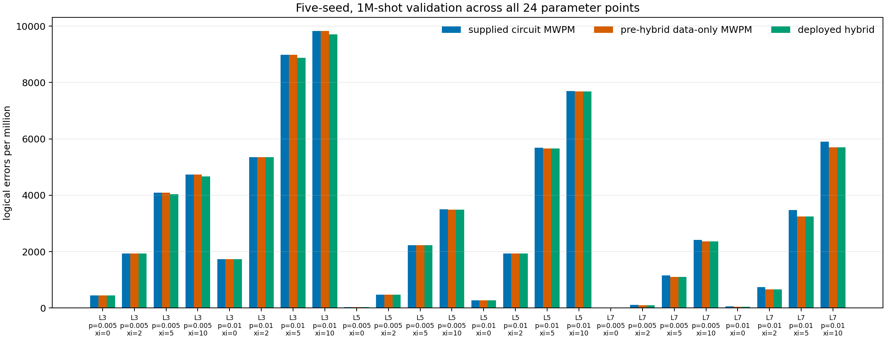
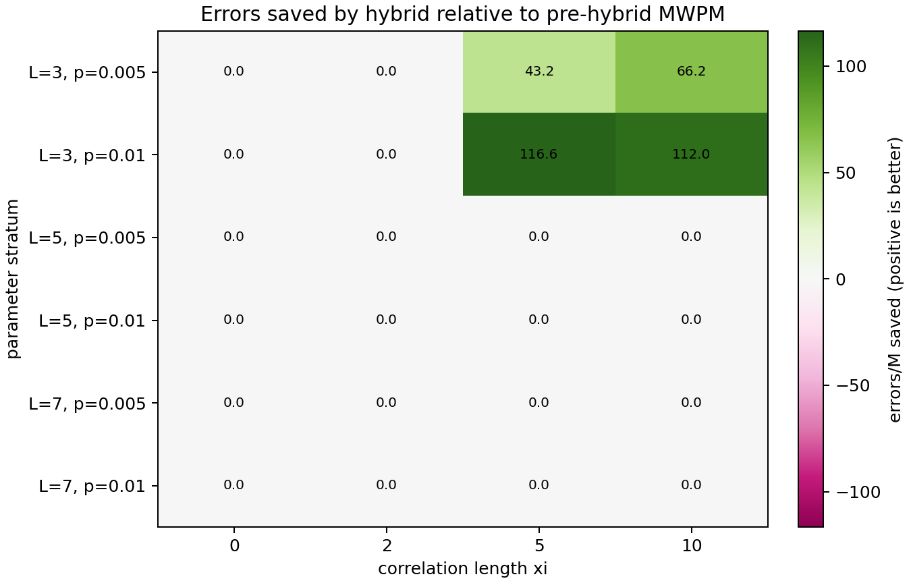
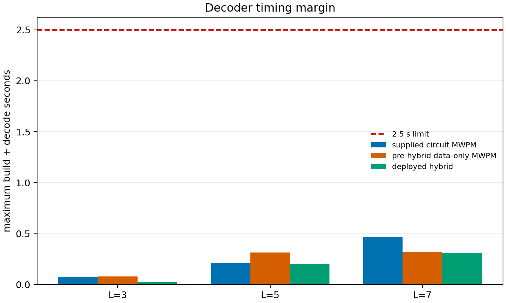
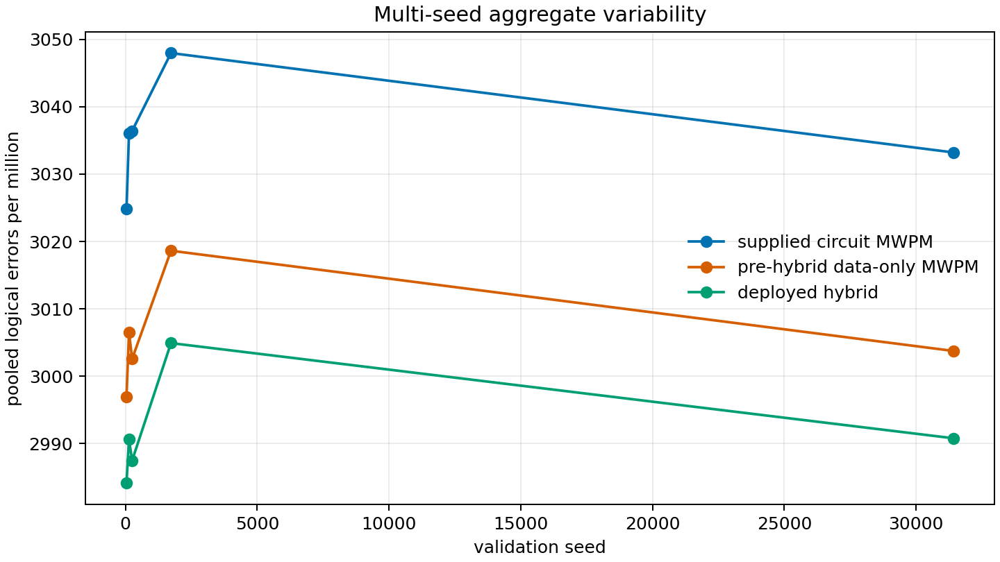

# Quantum Error-Correction Decoder

An independently reproducible investigation and submission for the
[Quantum Error Correction Challenge](https://github.com/MaxResnick/quantum_error_correction_challenge).
The project studies the supplied MWPM decoder and provides a calibrated,
data-only MWPM candidate that preserves the challenge interface.

## Result at a glance

The deployed candidate combines an offline Gaussian-copula MAP table for `L=3`
with data-only MWPM fallback for `L=5` and `L=7`. On the official 24-point,
1,000,000-shot benchmark across five seeds, it achieved **2,992 errors per
million** (358,992 / 120,000,000), compared with **3,006/M** for the pre-hybrid
decoder and **3,036/M** for the supplied circuit-level MWPM baseline. There
were no timeouts. The L=3 table saved 1,690 errors against the pre-hybrid
decoder; L=5/L=7 predictions remained unchanged. These are observed reductions,
not a claim of a complete correlated-noise decoder; see [`REPORT.md`](REPORT.md)
for limitations and the held-out research alternatives.

### Validation figures

The committed figures are generated from the paired five-seed receipt:









The direct syndrome-posterior architecture in `experiments/tracks/D/` remains
research-only. It showed a stronger signal for L=5 than L=7, but was not merged
because the L=7 evidence is support-limited and the approved deployment is the
conservative Track-A hybrid.

## Repository layout

```text
solve.py                 # final challenge submission; self-contained
run.py                   # upstream-compatible benchmark CLI
src/qec_benchmark/       # simulation, noise, scoring, and baseline package
scripts/                 # reproducible research and plotting utilities
experiments/             # reviewed JSONL, summaries, and benchmark logs
plots/                   # generated diagnostic figures
tests/                   # benchmark and submission-constraint tests
docs/                    # authoritative project and benchmark documentation
REPORT.md                # scientific investigation report
EXPERIMENT_LOG.md        # experiment decision log
pyproject.toml           # package and dependency metadata
uv.lock                  # reproducible dependency lockfile
```

## Challenge contract

- Modifyable submission surface: `solve.py` only.
- Required entry point: `build_decoder(point)`.
- Required decoder method: `decode(syndrome_array) -> predictions`.
- Input: binary array with shape `(shots, num_detectors)`.
- Output: binary `numpy.uint8` array with shape `(shots,)`.
- Official grid: `L ∈ {3, 5, 7}`, `p ∈ {0.005, 0.01}`, and
  `xi ∈ {0, 2, 5, 10}`.
- Score: pooled logical errors per million simulations.
- Time budget: construction plus decoding must be no more than 2.5 seconds per
  parameter point.
- Runtime restrictions: no file or network I/O during `decode()`.
- Submission size: `solve.py` must remain below 200 KB.

The submission is deliberately self-contained: it imports only `numpy`,
`pymatching`, `stim`, and standard-library typing support. It does not import
the local `qec_benchmark` package, read configuration files, sample new noise,
or perform network access during decoding.

## Reproduce locally

Python 3.10 or newer is required. `uv` is recommended; all environment files
are local and ignored by Git.

```bash
uv sync --dev
uv run pytest
uv run python run.py --grid tiny --shots 1000
uv run python run.py --shots 100000
uv run python run.py --validate --shots 50000
```

For a fresh virtual environment without `uv`:

```bash
python3.10 -m venv .venv
.venv/bin/python -m pip install --upgrade pip
.venv/bin/python -m pip install -e '.[dev]'
.venv/bin/pytest
```

The benchmark package is installed from `src/`; alternatively, development
commands can use `PYTHONPATH=src`.

## Reproduce experiments and plots

```bash
uv run python scripts/run_experiment.py \
  --decoder baseline --shots 50000 --validate \
  --output experiments/baseline_50k_validate.jsonl

uv run python scripts/run_experiment.py \
  --decoder final --shots 50000 --validate \
  --output experiments/final_50k_validate.jsonl

uv run python scripts/make_plots.py \
  --baseline experiments/baseline_50k_validate.jsonl \
  --improved experiments/final_50k_validate.jsonl \
  --outdir plots

uv run python scripts/make_hybrid_plots.py \
  --input experiments/hybrid/official_1m_5seeds_serial.jsonl \
  --outdir plots
```

The full 1M-shot run is intentionally more expensive:

```bash
uv run python run.py --shots 1000000
```

## Documentation

- [`docs/benchmark_contract.md`](docs/benchmark_contract.md): executable
  benchmark, noise model, scoring, and interface.
- [`docs/reproducibility.md`](docs/reproducibility.md): environment, commands,
  result schema, and artifact provenance.
- [`docs/constraint_compliance.md`](docs/constraint_compliance.md): submission
  size, I/O, runtime, and validation checks.
- [`REPORT.md`](REPORT.md): scientific report, hypotheses, ablations, results,
  and limitations.
- [`EXPERIMENT_LOG.md`](EXPERIMENT_LOG.md): observation → hypothesis →
  experiment → decision trace.

## Scope and limitations

The final decoder still uses an independent-error MWPM graph and therefore does
not explicitly infer the Gaussian-copula correlation length `xi`. Its measured
gain is best interpreted as correcting a baseline model mismatch. The retained
artifacts support a modest, reproducible aggregate reduction; they do not
support claims of universal pointwise improvement or optimality.

## License and upstream attribution

The challenge source retains its upstream MIT license and attribution. This
research workspace contains only local experiment tooling and the submission
candidate; no proprietary service or external dataset is required.
